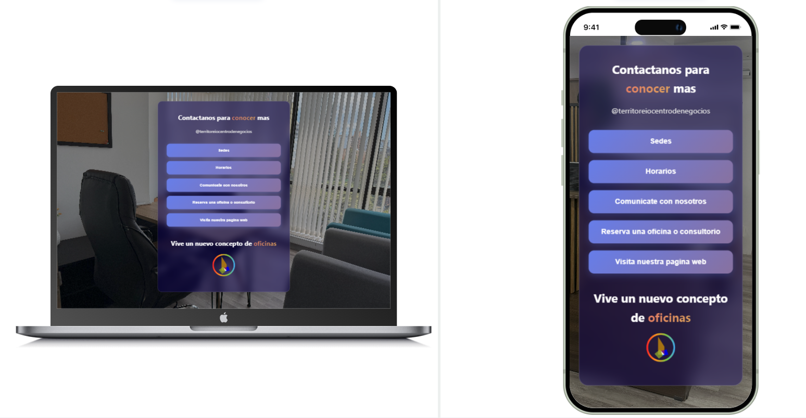

# README.md
# Página Estática de Contacto - Territorio Centro de Negocios

Una página web estática de contacto elegante y responsive para Territorio Centro de Negocios, diseñada para mostrar información de contacto, horarios y ubicaciones de manera interactiva.



## 🌟 Características

- **Diseño Responsive**: Optimizado para dispositivos móviles, tablets y escritorio
- **Submenús Interactivos**: Información desplegable para sedes y horarios
- **Integración con WhatsApp**: Contacto directo con asesores
- **Enlaces a Google Maps**: Ubicaciones exactas de las sedes
- **Optimización de Imágenes**: Preload de imágenes de fondo para mejor rendimiento
- **Efectos Visuales**: Animaciones suaves y efectos de backdrop-filter

## 📁 Estructura del Proyecto

```
Pagina-Estatica-Contacto-TCN/
├── index.html              # Página principal
├── styles.css              # Estilos CSS
├── background-optimizer.js # Script de optimización de imágenes
├── images/                 # Carpeta de imágenes
│   ├── backgroundmovile.jpg
│   ├── backgroundlaptop.jpg
│   └── territoriocentrodenegocios logo.png
└── README.md               # Documentación del proyecto
```

## 🚀 Características Principales

### Menús Interactivos
- **Sedes**: Despliega información de las dos ubicaciones
  - Sede Bucaramanga
  - Sede Floridablanca, Cañaveral
- **Horarios**: Muestra los horarios de atención
  - Lunes a Viernes: 8:00 AM - 12:00 PM y 2:00 PM - 6:00 PM
  - Sábados: 8:00 AM - 12:00 PM y 2:00 PM - 5:00 PM

### Funcionalidades
- **Comunicación directa**: Enlace a WhatsApp con mensaje preconfigurado
- **Navegación a ubicaciones**: Enlaces directos a Google Maps
- **Página web oficial**: Redirección a la página principal de la empresa

## 🛠️ Tecnologías Utilizadas

- **HTML5**: Estructura semántica
- **CSS3**: Estilos modernos con backdrop-filter y animaciones
- **JavaScript Vanilla**: Funcionalidad interactiva sin dependencias
- **Google Maps**: Integración para ubicaciones
- **WhatsApp API**: Comunicación directa

## 📱 Responsive Design

La página está optimizada para:
- **Móviles**: Imagen de fondo específica y layout adaptado
- **Tablets**: Diseño flexible que se adapta al tamaño
- **Escritorio**: Aprovecha el espacio disponible con imagen de alta resolución

## 🎨 Características de Diseño

- **Gradientes modernos**: Fondos con degradados atractivos
- **Efectos glassmorphism**: Uso de backdrop-filter para efectos de cristal
- **Animaciones suaves**: Transiciones y efectos hover
- **Tipografía clara**: Jerarquía visual bien definida

## 📞 Información de Contacto

- **WhatsApp**: +57 316 788 0609
- **Instagram**: @territoreiocentrodenegocios
- **Página Web**: https://www.territoriocentrodenegocios.com/

## 📍 Ubicaciones

### Sede Bucaramanga
[Ver en Google Maps](https://www.google.com/maps/place/Territorio+Centro+de+Negocios/@7.1235422,-73.1165128,17z)

### Sede Floridablanca, Cañaveral
[Ver en Google Maps](https://www.google.com/maps/place/Territorio+Centro+de+Negocios/@7.0691063,-73.1048134,19z)

## 🚀 Instalación y Uso

1. **Clona el repositorio**:
   ```bash
   git clone https://github.com/usuario/Pagina-Estatica-Contacto-TCN.git
   ```

2. **Navega al directorio**:
   ```bash
   cd Pagina-Estatica-Contacto-TCN
   ```

3. **Abre el archivo index.html** en tu navegador web preferido

## 📝 Personalización

### Cambiar Información de Contacto
Edita las siguientes líneas en `index.html`:
- Número de WhatsApp: línea con `phone=573167880609`
- Instagram: línea con `@territoreiocentrodenegocios`
- URL de la página web: línea con `https://www.territoriocentrodenegocios.com/`

### Modificar Horarios
Actualiza el contenido en la sección `horarios-submenu` en `index.html`

### Cambiar Ubicaciones
Modifica los enlaces de Google Maps en la sección de JavaScript

## 🔧 Optimizaciones Implementadas

- **Preload de imágenes**: Carga anticipada de imágenes de fondo
- **Media queries**: Imágenes específicas según el dispositivo
- **Compresión de código**: JavaScript optimizado
- **SEO básico**: Meta tags y estructura semántica

## 📄 Licencia

Este proyecto está bajo la Licencia MIT. Ver el archivo `LICENSE` para más detalles.

## 👥 Contribuir

1. Fork el proyecto
2. Crea una rama para tu feature (`git checkout -b feature/AmazingFeature`)
3. Commit tus cambios (`git commit -m 'Add some AmazingFeature'`)
4. Push a la rama (`git push origin feature/AmazingFeature`)
5. Abre un Pull Request

## 📧 Contacto

**Territorio Centro de Negocios**
- WhatsApp: +57 316 788 0609
- Web: https://www.territoriocentrodenegocios.com/
- Instagram: @territoreiocentrodenegocios

---

*Desarrollado con ❤️ para Territorio Centro de Negocios*